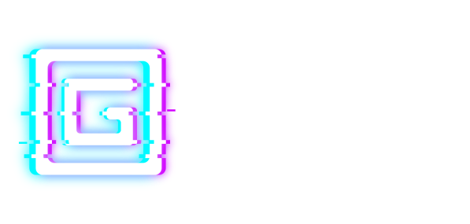

# Glitch Wallet Extension

## Prerequisites

- NodeJS >= v11
- Yarn latest

### Installation

### Developers
Execute the following to clone, install dependencies, and run a development server:

    git clone https://github.com/glitchdefi/wallet_ext
    cd wallet_ext
    yarn install
    yarn start
    
### Tester

    git clone https://github.com/glitchdefi/wallet_ext

Once running Chrome:

- Go to chrome://extensions
- Enable 'Developer Mode' (top right corner of window)
- Click "Load Unpacked" and select the wallet_ext/build directory

The Glitch Wallet icon should show up in your Chrome toolbar.
